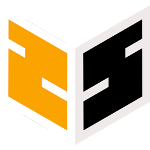

# Zspin

### [Click here to read the English version](README.md)    

zspin est un frontend pour jeux d'arcade, qui fonctionne sur windows, linux et OSX.    
C'est en beta alors attention aux bugs !    
N'hesitez pas a ouvrir une issue ou m'envoyer une PR !

## Specifications actuelles

* Compatible OSX, Linux, Windows
* Gestion des themes et preferences d'hyperspin (basique)
* Support des themes HTML5
* Support multilanguage
* Auto redimensionnement des themes (1080p et au dela)
* Lancement par launcher personnalisable
* Support des claviers / gamepads / joysticks en natif
* Wheels complètement customizables, avec possibilité d'utiliser les sub-wheels à l'infini
* Ecran d'options
* Assistant de premier démarrage / configuration
* Application au lancement / a la sortie
* API basique

## Installation

* [Download a release](https://github.com/HFSCode/zspin/releases)
* Extract and run Zspin
* Select your data folder & game launcher binary
* Configure your keys (or joystick)
* Save and go to the main menu

## Specifications du futur

* Meilleur support des themes
* Trucs cooperatifs ? (qui joue a quoi)
* Configuration par le reseau ?
* Si vous avez une idee dites le moi !

## Aider au projet
Il y a plein de choses que vous pouvez faire et qui aident BEAUCOUP:    

* Documentation
* Traductions
* Tester / decrire les bugs
* Trouver quoi ajouter a cette liste

#### Ouvrez [une issue](https://github.com/HFScode/zspin/issues), venez parler avec nous [sur notre forum](http://forum.hfsplay.fr/zspin-f113/), ou [sur gitter](https://gitter.im/HFScode/zspin).

## Pour developper et/ou pour la documentation
#### [Faites un tour sur le wiki !](https://github.com/HFScode/zspin/wiki/)

## License

zspin est sous license [Creative Commons Attribution-NonCommercial-ShareAlike 4.0 International License](http://creativecommons.org/licenses/by-nc-sa/4.0/).

Si vous voulez vendre du materiel avec zspin installé dessus (utilisation commerciale), [Contactez moi](mailto:v@42.am?subject=Je+veux+une+license+!) ! Je vous fournirais une license pour ca.